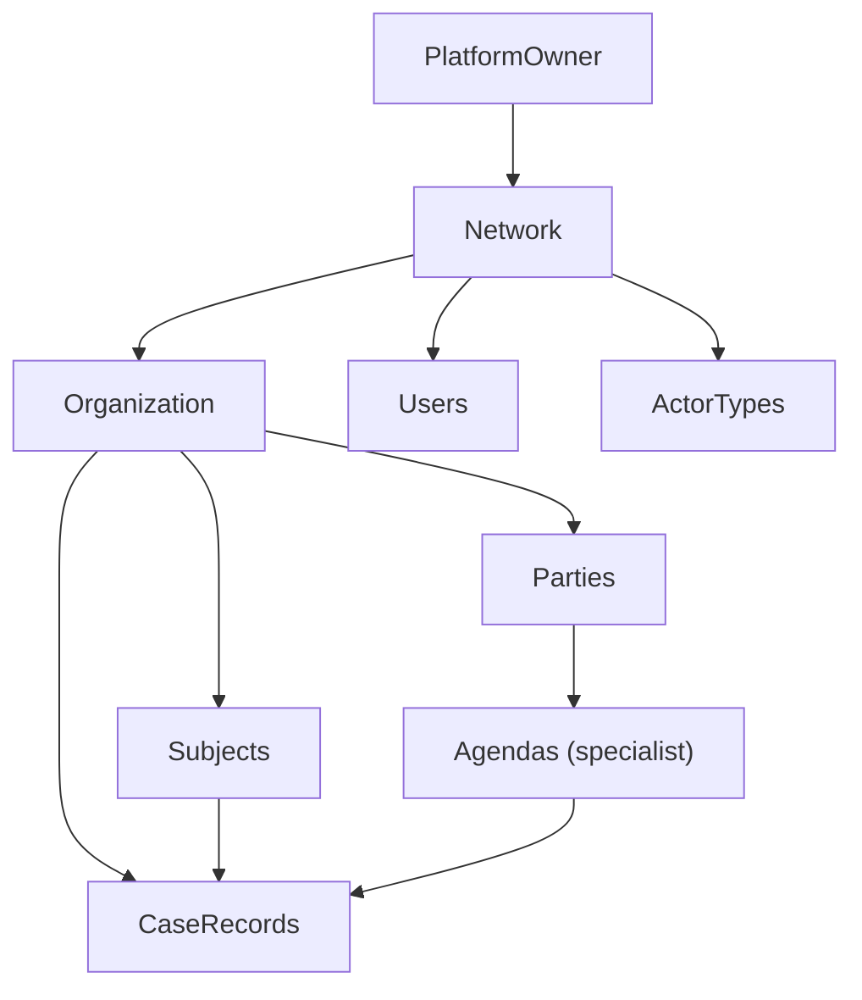
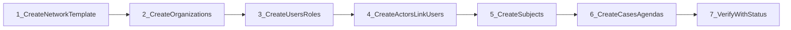
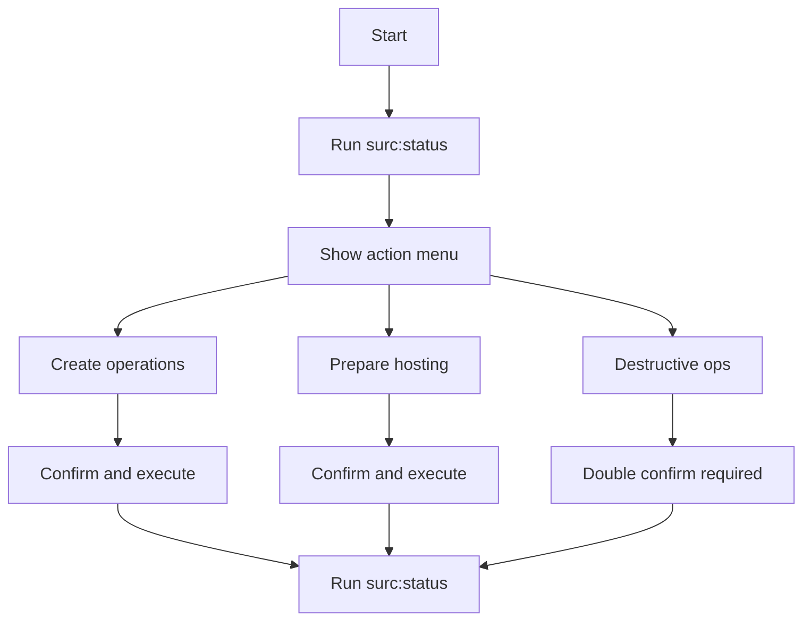
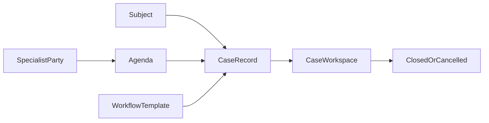

# Esquemas de comportamiento SURC

## Jerarquía de configuración

```mermaid
flowchart TD
  PlatformOwner["PlatformOwner"] --> Network["Network"]
  Network --> Organization["Organization"]
  Network --> Users["Users"]
  Network --> ActorTypes["ActorTypes"]
  Organization --> Parties["Parties"]
  Organization --> Subjects["Subjects"]
  Organization --> Cases["CaseRecords"]
  Parties --> Agendas["Agendas (specialist)"]
  Subjects --> Cases
  Agendas --> Cases
```

## Orden recomendado de setup

```mermaid
flowchart LR
  Step1["1_CreateNetworkTemplate"] --> Step2["2_CreateOrganizations"]
  Step2 --> Step3["3_CreateUsersRoles"]
  Step3 --> Step4["4_CreateActorsLinkUsers"]
  Step4 --> Step5["5_CreateSubjects"]
  Step5 --> Step6["6_CreateCasesAgendas"]
  Step6 --> Step7["7_VerifyWithStatus"]
```

## Flujo de decisión del asistente

```mermaid
flowchart TD
  Start["Start"] --> Status["Run surc:status"]
  Status --> Menu["Show action menu"]
  Menu --> Create["Create operations"]
  Menu --> Host["Prepare hosting"]
  Menu --> Destructive["Destructive ops"]
  Create --> ConfirmCreate["Confirm and execute"]
  Host --> ConfirmHost["Confirm and execute"]
  Destructive --> ConfirmDanger["Double confirm required"]
  ConfirmCreate --> Refresh["Run surc:status"]
  ConfirmHost --> Refresh
  ConfirmDanger --> Refresh
```

## Ciclo operativo de un caso (alto nivel)

```mermaid
flowchart LR
  Subject["Subject"] --> CaseRecord["CaseRecord"]
  Specialist["SpecialistParty"] --> Agenda["Agenda"]
  Agenda --> CaseRecord
  Workflow["WorkflowTemplate"] --> CaseRecord
  CaseRecord --> Workspace["CaseWorkspace"]
  Workspace --> Closed["ClosedOrCancelled"]
```
